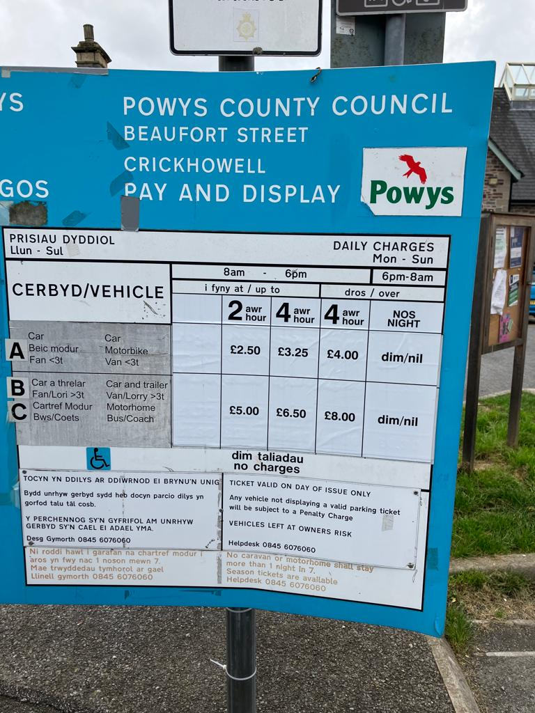

# Crickhowell Car Park Analysis

Code for analysing ticket sale data from the car park in Crickhowell.



## Documents

### Covering September 2017 to September 2023

- Summary stats ([HTML](http://tom-e-white.com/crick-parking/parking-stats.html))

### Covering September 2017 to May 2019

- Report ([HTML](http://tom-e-white.com/crick-parking/parking.html)) ([PDF](http://tom-e-white.com/crick-parking/parking.pdf))
- Presentation ([PDF](http://tom-e-white.com/crick-parking/CrickhowellCarParkAnalysis.pdf))

## Car park tariffs

This analysis is mainly concerned with tickets for cars (for 1 hour, 2 hour,
4 hour, and all day tickets), since sales for other categories are tiny in
comparison.

The following table shows the four ticket types and how their prices have
changed over time.

| Code | Vehicle | Duration | 2017 price | 2019 price | 2023 price |
| ---- | ------- | -------- | ---------- | ---------- | ---------- |
| A    | Car     | 1 hour   | £0.70      | £1.00      | N/A        |
| B    | Car     | 2 hour   | £1.30      | £2.00      | £2.50      |
| C    | Car     | 4 hour   | £2.50      | £3.00      | £3.25      |
| D    | Car     | All day  | £3.20      | £4.00      | £4.00      |

Note that from 2023 there is no 1 hour ticket available (in Powys long stay car parks, of which Crickhowell is one).

Here is an [article](https://www.bbc.co.uk/news/uk-wales-48094482) about the 2019 price increases.
And for [2023](https://en.powys.gov.uk/article/14171/Car-park-charges-to-increase-in-April).

The transaction data showed that the new charges started on 25 April 2023. I don't have data for the other change over dates.

## Running the analyses

There are two type of analysis: summary stats (using R), and the overcrowding analysis using daily ticket sales graphs (using Python).

### Summary stats (R)

In RStudio, open `parking-stats.Rmd` and click the "Knit" button to create an HTML report.

### Overcrowding (Python)

In a new virtual env run the following:

```shell
pip install -r requirements.txt
python analyse.py
```
