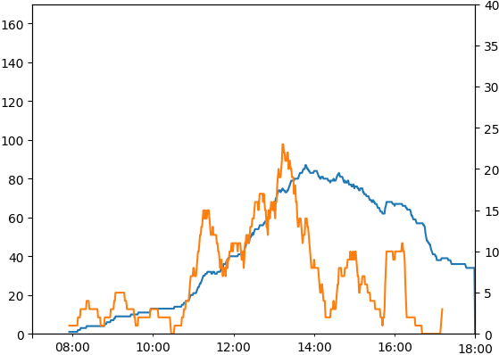

```{r include = FALSE}
knitr::opts_chunk$set(echo = FALSE)
```

_Tom White and Eliane Wigzell, July 2019_

We analysed ticket data for the two machines in Crickhowell's Long Stay car park from September 2017 to May 2019.

## Summary

Our key findings are:

1. The most popular ticket is the 2 hour ticket, followed by the 1 hour ticket.
2. Most tickets are sold between 12 and 1pm.
3. Saturdays are the busiest day of the week, with 15% more tickets being sold than Fridays (the next busiest day).
4. The car park is very likely to be overcrowded on Saturdays and Bank Holidays, especially in good weather.
5. Monthly usage increases through the year, with May being 50% busier than January.
6. An average of 25 all day tickets are sold every day, which is 20% of the car park capacity.

## Approach

The summary statistics for ticket popularity, and busy times were performed with standard statistical analysis (see appendix). For analysing overcrowding we carried out a more involved analysis described next.

Each ticket sold is one of: 1 hour, 2 hour, 4 hour, all day - for cars. We ignored tickets for other categories of vehicle since the numbers are tiny in comparison with those for cars.

We considered the period from 8am to 6pm, since this is when charges apply. We made the simplifying assumption that each ticket was used for the full amount of time allowed, so for example a 2 hour ticket would be used for the full 2 hours. Of course, this is not a realistic assumption, since it overcounts vehicles that leave before the ticket expires. On the other hand, it undercounts vehicles that overstay, or those with no ticket at all. It's not possible to estimate the relative importance of these two effects without further information (such as data from spot surveys).

With this assumption we created graphs showing the estimated number of cars in the car park over a day. (The blue lines in the graphs.) 

We also looked at the rate of ticket sales over a short period of time (typically 30 minutes) and plotted this on the same graph (as an orange line).

For example, here is the graph for Thursday 4 April:


The blue line shows the number of cars in the car park (left scale). It starts at zero at 8am, and rises to about 80 just before 2pm, then drops off again.

The orange line shows the number of cars arriving (that tickets were bought for) in a 30 minute period (right scale). This is a bit more erratic, but the general pattern is that around 10 tickets per 30 minute period were bought in the morning (so about one every three minutes). Then there was a lunchtime peak of about 25 tickets per 30 minute period, at around 1pm, before dropping off in the afternoon.

Compare this with the graph for the late May Bank Holiday:


It's clear that the car park was a lot busier on this day, as the peak estimated occupancy was around 140. (There are only 130 spaces, so the modelling assumption that everyone stayed for the full time on their ticket is clearly not true.) Notice the rapid drop in the orange line at midday, from over 40 tickets being sold per 30 minute period, to 10 tickets being sold per 30 minute period. Since the estimated occupancy was around 120 at this time, this rapid drop can be interpreted as the car park being full.

The key insight here is that we can detect when the car park is full by looking for very rapid drops in ticket sales.

From a visual scan of graphs for the data set, this happened on the following days in 2019:

* Friday, 4 January
* Saturday, 5 January
* Tuesday, 8 January
* Saturday, 12 January
* Saturday, 2 February
* Tuesday, 5 February
* Friday, 22 February
* Saturday, 6 April
* Saturday, 11 April
* Friday, 19 April (Easter)
* Saturday, 20 April (Easter)
* Saturday, 4 May (Bank Holiday weekend)
* Tuesday, 7 May
* Friday, 10 May
* Tuesday, 14 May
* Saturday, 18 May
* Saturday, 25 May (Bank Holiday weekend)
* Monday, 27 May (Bank Holiday weekend)

Most are Saturdays, but Fridays are busy too.

## Weather

Crickhowell had heavy snow on 1 February (a Friday), and it shows in very light car park usage:


And on Sunday 3 March Storm Freya hit, so few people ventured in to town:


A week later the usage was back to normal:



## Limitations

1. People who buy a ticket may not spend the full amount of time parked in the car park. For example, someone with a 2 hour ticket may leave before the 2 hours expire. Or they may overstay. There is no way to tell when a vehicle leaves the car park.
2. Some vehicles have permits or Blue Badges and they do not appear in the data. It has been estimated that there are around 10 vehicles with permits and 10 with Blue Badges that this applies to.
3. Some people don't buy a ticket at all.
4. Since the machines only log tickets sold, there is no way to discover how full the car park actually is at any particular time. 

## Appendix: Statistical Analysis

```{r message=FALSE, warning=FALSE}

library(dplyr)
library(ggplot2)
library(lubridate)
library(scales)
library(stringr)
library(tidyr)
library(knitr)
library(readr)
library(purrr)

carpark_raw <- list.files("data", pattern = "*.csv") %>% 
    map_df(~read_csv(paste0("data/", .)))

carpark <- carpark_raw %>%
  mutate(Description.1 = Description_1) %>%
  mutate(dt = dmy_hm(Date)) %>%
  mutate(date = lubridate::date(dt)) %>%
  mutate(day = weekdays(dt)) %>%
  mutate(hour = hour(dt)) %>%
  mutate(month = month(dt)) %>%
  mutate(year = year(dt)) %>%
  filter(date >= "2017-09-01") # filter out since some car parks logged the ticket putting it into the wrong category

carpark$day <- factor(carpark$day, levels = c("Monday", "Tuesday", "Wednesday", "Thursday", "Friday", "Saturday", "Sunday"))
```

Which tickets are the most popular? 2 hour ones:

```{r}
# Freq: 2hr, 1hr, 4hr, all day
kable(carpark %>% group_by(Tariff, Description.1) %>% tally(sort = TRUE))
```

Average tickets sold by day:

```{r}
kable(carpark %>% group_by(date, day) %>% summarize(count=n()) %>% group_by(day) %>% summarise(average = mean(count)))
```

Average number of all day tickets sold per day:

```{r}
kable(carpark %>%
  filter(Tariff == '105D') %>%
  group_by(date, day) %>%
  summarize(count=n()) %>%
  group_by(day) %>%
  summarise(average = mean(count)))
```

Overall:

```{r}
kable(carpark %>%
  filter(Tariff == '105D') %>%
  group_by(date) %>%
  summarize(count=n()) %>%
  summarise(average = mean(count)))
```

Average number of all day tickets sold per day before midday - shows that most are bought in the morning.

```{r}
kable(carpark %>%
  filter(Tariff == '105D' & hour < 12) %>%
  group_by(date, day) %>%
  summarize(count=n()) %>%
  group_by(day) %>%
  summarise(average = mean(count)))
```

During which months is the car park most busy? It's busier in summer than in winter.

```{r warning=FALSE}
carpark %>%
  mutate(month = as.factor(month)) %>%
  mutate(year = as.factor(year)) %>%
  group_by(month, year) %>%
  summarize(count=n()) %>%
  complete(month, year) %>% # https://stackoverflow.com/questions/11020437/consistent-width-for-geom-bar-in-the-event-of-missing-data
  ggplot(aes(x=month, y=count, fill=year)) +
  geom_bar(stat="identity", position=position_dodge())
```

Which days of week are the most busy? Saturday is the busiest.

```{r}
kable(carpark %>% group_by(day) %>% tally(sort = TRUE))
```

At what time of day do people buy tickets? 12-1pm is the busiest hour.

```{r}
ggplot(carpark, aes(hour)) +
  geom_histogram(binwidth=1)
```

Broken down by day.

```{r}
ggplot(carpark, aes(hour)) +
  geom_histogram(binwidth=1) +
  facet_wrap(~ day, ncol=4)
```
  
Broken down by month.
  
```{r}
ggplot(carpark, aes(hour)) +
  geom_histogram(binwidth=1) +
  facet_wrap(~ month, ncol=4)
```
